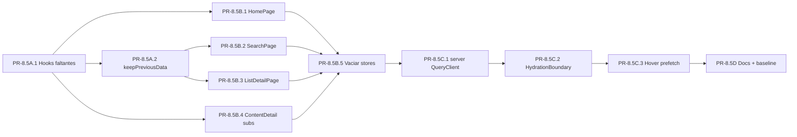

# Sprint 08.5
# Migración completa de reads a TanStack Query + SSR prefetch

> **Nota sobre el alcance y la numeración.** Este sprint es un
> "punto cinco" de [`sprint-08`](./sprint-08-performance-and-perceived-speed.md):
> cierra deuda técnica directa de 8C antes de abrir el frente de
> `sprint-09` (rehidratación de sesión). Mismo patrón de numeración
> que ya se usó en `done-sprint-04.5`. En 8C se introdujo
> `@tanstack/react-query`, se montó el `QueryProvider`, se creó el
> factory `queryKeys`, los hooks `use*Query`, las cuatro mutaciones
> críticas (`use*Mutation`) y se migró sólo `ContentDetailPage` como
> prueba de patrón. El read-path de las páginas restantes (Home,
> ListDetail, Search, secciones del detalle, AddToListModal) sigue en
> Zustand + `useEffect` + `fetch`. Este sprint cierra esa migración y
> aprovecha para dar el siguiente salto de performance: **prefetch en
> el server**.

## Objetivo

Eliminar la coexistencia entre dos sistemas de gestión de server state
(Zustand "store con TTL manual" + TanStack Query) que hoy fragmenta la
caché, duplica el código de loading/error/retry y bloquea ganancias de
performance que requieren cache compartida (request-coalescing entre
tabs, prefetch en hover de cualquier card, SWR consistente).

La tesis del sprint:

1. **Una sola fuente de verdad** para cada server resource: TanStack
   Query. Zustand pasa a ser exclusivamente client/UI state (auth,
   modales, country selector, drag&drop ephemeral state).
2. **El primer paint debe llegar con datos**, no con skeletons. App
   Router 16 + `HydrationBoundary` + `prefetchQuery` server-side =
   LCP medible bajando otra vez sin tocar diseño.
3. **El cache de Query reemplaza al "TTL de 5 minutos"** que hoy
   `lists-store` y `content-store` reimplementan a mano.

## Entregable principal

- Reads de Home, Search, ListDetail (paginado + bootstrap), AddToListModal
  y todos los sub-componentes de ContentDetailPage (RatingsSection,
  useUserRating) migrados a hooks `use*Query`.
- Caches "TTL manual" eliminadas de `lists-store` y `content-store`
  (esos stores quedan reducidos a *acciones* + estado UI residual o
  desaparecen).
- Prefetch server-side via `HydrationBoundary` en `/`, `/lists/[id]`,
  `/content/[id]`, `/search` — el HTML llega ya con datos serializados.
- Hover-prefetch ampliado a `SearchPage` y a las cards de
  recomendaciones de `HomePage`.
- Polish de UX integrado en los flujos migrados: placeholders
  dimensionalmente estables, estados vacíos por sección, búsqueda sin
  resultados obsoletos, hover expandible consistente y modales de rating
  reutilizados.
- Documento `docs/architecture/data-fetching.md` que codifica la regla
  "server state → React Query, client state → Zustand" con ejemplos.
- Tests de regresión: `staleTime` por recurso respetado, mutaciones
  invalidando las keys correctas, no hay double-fetch en montaje.
- Métricas Web Vitals re-medidas y registradas en `docs/perf/baseline.md`
  (columna `after 8.5`).

## Skills guía

- `vercel-react-best-practices`
- `clean-code`
- `python-project-structure` (para el contrato HTTP del lado servidor
  que va a alimentar el prefetch)
- `systematic-debugging`

## Alcance

### Frontend (`web/`)

- `web/lib/api/queries/` — nuevos hooks: `useSuggestionsQuery`,
  `useMultiSearchQuery`, `useListMetadataQuery`, `useListStatsQuery`,
  `useRatingsListQuery`, `useUserRatingQuery`, `useFullListItemsQuery`.
- `web/lib/api/queries/keys.ts` — extender `queryKeys` con las nuevas
  familias (`suggestions`, `search`, `listStats`, `ratings`,
  `userRating`).
- `web/lib/api/queries/server.ts` (nuevo) — helper `getServerQueryClient()`
  + `dehydrate()` para prefetch en server components.
- `web/lib/api/mutations/` — nueva mutación `useUpsertUserRatingMutation`
  (extracción de la lógica de `useUserRating.handleSubmitRating`).
- `web/app/_components/pages/HomePage/hooks/useHomeData.ts` — refactor
  completo a `useSuggestionsQuery` + `useUserListsQuery`.
- `web/app/_components/pages/SearchPage/hooks/useSearchResults.ts` —
  refactor a `useMultiSearchQuery` con `placeholderData: keepPreviousData`
  y debounce server-side via `useDeferredValue`; cada query nueva cancela
  o descarta la request anterior para no mostrar resultados viejos.
- `web/app/_components/pages/ListDetailPage/hooks/useListData.ts` y
  `useDataStrategy.ts` — refactor a 3 queries paralelas (`metadata`,
  `stats`, `items`) con `keepPreviousData` para paginación sin
  flash-loading.
- `web/app/_components/pages/ContentDetailPage/hooks/useUserRating.ts`
  y `components/RatingsSection.tsx` — pasar a `useUserRatingQuery` +
  `useRatingsListQuery` + `useUpsertUserRatingMutation`.
- `web/app/_components/common/modals/AddToListModal/index.tsx` —
  consumir `useUserListsQuery` en vez de `fetchLists` del store y dejar
  el flujo listo para selección tipo checkbox, sin cerrar el modal al
  añadir o quitar una lista.
- `web/app/_stores/lists-store.ts`, `content-store.ts` — vaciar la
  lógica de fetch; sólo quedan acciones de mutación que el store
  expone hoy y que ya están encapsuladas en mutaciones.
- `web/app/_stores/settings-store.ts` — eliminar el toggle de
  animaciones si ya no hay settings persistentes que justifiquen el
  store.
- `web/app/page.tsx`, `web/app/lists/[id]/page.tsx`,
  `web/app/content/[id]/page.tsx`, `web/app/search/page.tsx` —
  prefetch server-side + `<HydrationBoundary state={dehydrate(qc)}>`.
- `web/app/_providers/QueryProvider.tsx` — separar en
  `QueryClientProvider` cliente (sin cambios) + helper para crear
  un `QueryClient` server-side con `staleTime: 0` por request.
- `web/app/_components/common/cards/SearchResultCard/` (si existe;
  buscar el componente análogo) — `useHoverPrefetch`.

### Documentación

- `docs/architecture/data-fetching.md` (nuevo) — política, ejemplos,
  anti-patrones.
- `docs/perf/baseline.md` — columna `after 8.5`, mediciones nuevas.
- `CONTRIBUTING.md` — actualizar el checklist frontend con la regla
  "no nuevos `useEffect` + `fetch` en App Router; usar `useQuery`".

## No objetivos

- **No** introducir `next-safe-action`, `tRPC` ni un BFF nuevo. La
  capa HTTP sigue siendo `web/lib/api/actions/` con `fetch`.
- **No** rehacer la auth ni `AuthSessionBootstrap` (eso fue Sprint 9).
- **No** persistir el cache de Query a `localStorage`/`IndexedDB`.
  La persistencia entre sesiones la cubren los Detail rows locales
  de Sprint 7. Si en el futuro se quiere snapshot del cache para
  warm-start, va en otro sprint.
- **No** mover el render del detalle a server component completo —
  hoy es client component porque depende de mutaciones y modales.
  El prefetch server-side resuelve el LCP sin esa cirugía.
- **No** unificar `country` en el QueryClient (decisión: cada hook
  recibe `country` explícito, no se lee del provider).
- **No** introducir Suspense queries (`useSuspenseQuery`) en este
  sprint. Los `loading.tsx` y skeletons existentes ya cubren el caso.
  Migrar a Suspense queries va aparte.
- **No** hacer fetch automático de la lista completa en segundo plano
  para todos los casos paginados. La lista completa sólo se carga de
  forma lazy cuando una interacción concreta la necesita, como reorder.
- **No** volver al contrato `page_size=0`; si un endpoint necesita
  devolver todo, usar el contrato explícito vigente.
- **No** implementar agrupamiento de listas en N niveles. Este sprint
  sólo corrige presentación, headers y controles de paginación donde el
  flujo existente lo requiera.

## Dependencias

- **Requiere Sprint 8 mergeado** (provee `QueryProvider`, `queryKeys`,
  hooks base, mutaciones, `usePrefetchContentDetail`).
- **Sprint 7 ya está mergeado**: los Detail rows locales viven en DB
  local; este sprint puede subir `staleTime` de `useContentDetailQuery`
  a 30 minutos sin riesgo, porque la frescura la maneja la
  rehidratación de Sprint 10.
- **Bloqueante para Sprint 9**: la rehidratación de auth de Sprint 9
  asume que cualquier ruta protegida monta el `QueryClientProvider`
  globalmente (cosa que Sprint 8 ya garantizó) y se beneficia de
  prefetch server-side cuando `resolveSession()` confirma el usuario.
  Hacer 8.5 antes de 9 mantiene esa secuencia natural: primero
  consolidamos el data layer, después consolidamos la sesión sobre él.
- **No bloquea Sprint 10**: la rehidratación dinámica por edad de
  contenido es server-side; el cache de Query es transparente para esa
  pipeline. Sí permite, después de 10, subir `staleTime` de
  `useContentDetailQuery` con tranquilidad.

## Contexto técnico (lo que el dev necesita saber antes de empezar)

### Lo que ya está hecho en Sprint 8 y se puede reusar tal cual

```typescript
// web/lib/api/queries/keys.ts — factory ya existente
queryKeys.lists.list(params)
queryKeys.lists.detail(id, params)
queryKeys.listItems.all(listId)
queryKeys.listItems.page(listId, params)
queryKeys.contentDetail.byId(id, country)

// web/lib/api/queries/ — hooks ya existentes
useUserListsQuery()
useUserListQuery(id)
useListItemsQuery(listId, params)
useContentDetailQuery(id, country)
usePrefetchContentDetail()

// web/lib/api/mutations/ — mutaciones ya existentes
useToggleListItemStatusMutation()
useRateContentMutation()
useAddContentToListMutation()
useReorderListItemsMutation()

// web/lib/perf/useHoverPrefetch.ts — hook genérico
useHoverPrefetch(prefetchFn, { delayMs: 200 })

// web/app/_providers/QueryProvider.tsx — provider client-side ya montado
```

### Lo que NO existe todavía y este sprint introduce

- `getServerQueryClient()` — fábrica de QueryClient *por request* en
  el server (no se puede compartir entre requests porque mezclaría
  datos de usuarios distintos).
- `<HydrationBoundary>` en cada page route que pueda prefetchear.
- `keepPreviousData` para paginación / búsquedas debounced (evita
  parpadeo entre página N y N+1).
- Hooks `use*Query` para suggestions, search, ratings, list metadata,
  list stats, user rating, full list items.

### Riesgo principal: doble fetch en SSR + CSR

En App Router, si prefetcheás server-side y montás `useQuery` con la
misma key client-side, el dato sale del cache y no hay segundo fetch
**solo si**:

1. La `queryKey` es **idéntica** (mismo string serializado, mismos
   parámetros, mismo orden).
2. El `dehydrate(qc)` se serializa a un `<script>` que llega antes de
   que React monte el cliente — `<HydrationBoundary>` se encarga.
3. `staleTime` es > 0 al momento del montaje (si es 0, Query
   invalida inmediatamente y refetchea).

El test de no-doble-fetch debe ser parte del DoD de cada migración.

---

## Backlog por lotes

### Lote 8.5A
**Nombre:** Hooks de read faltantes (read-only refactor)
**Resultado:** existe un `useQuery` por cada read que hoy vive en
Zustand o `useEffect`. Las páginas siguen usando los stores; los
nuevos hooks coexisten para validar el patrón sin romper nada.

### Lote 8.5B
**Nombre:** Migración de páginas y eliminación de stores de server state
**Resultado:** Home, Search, ListDetail, ContentDetailPage,
AddToListModal consumen los hooks nuevos. `lists-store` y
`content-store` quedan vaciados de lógica de fetch; sólo retienen
acciones de mutación (que ya están envueltas por las mutaciones de
Sprint 8) o se eliminan por completo.

### Lote 8.5C
**Nombre:** SSR prefetch + HydrationBoundary
**Resultado:** las 4 page routes principales (`/`, `/content/[id]`,
`/lists/[id]`, `/search`) prefetchean server-side y entregan HTML con
el cache hidratado. LCP de Home y Search cae medido vs `after 8C`.

### Lote 8.5D
**Nombre:** Documentación, baseline y guardas
**Resultado:** `docs/architecture/data-fetching.md` codifica la regla
"server state → React Query, client state → Zustand". `baseline.md`
tiene columna `after 8.5`. CONTRIBUTING incorpora "no nuevos
`useEffect`+`fetch`".

---

## Secuencia detallada de PRs

### PR-8.5A.1 — Hooks de read faltantes

Crear, **sin tocar páginas todavía**, los hooks que hoy no existen.
Cada uno wrappea su `*Action` correspondiente y registra una key en
`queryKeys`.

Hooks a crear (con `staleTime` propuesto, calibrar después con
mediciones):

| Hook | staleTime | Razón |
|---|---|---|
| `useSuggestionsQuery(pageSize)` | 5 min | Suggestions cambian poco intra-sesión |
| `useMultiSearchQuery(query, opts)` | 30 s | Resultados de búsqueda |
| `useListMetadataQuery(listId)` | 60 s | Metadata cambia por mutaciones del owner |
| `useListStatsQuery(listId)` | 60 s | Stats agregadas |
| `useRatingsListQuery(contentItemId, page)` | 30 s | Lista paginada de ratings |
| `useUserRatingQuery(contentItemId, userId)` | 30 s | Rating del usuario actual |
| `useFullListItemsQuery(listId)` | 30 s | Carga "todos los items" para reorder |

Extender `queryKeys`:

```typescript
queryKeys.suggestions.byPageSize(n)
queryKeys.search.multi(query, limit)
queryKeys.lists.stats(listId)
queryKeys.ratings.list(contentItemId, page)
queryKeys.ratings.byUser(contentItemId, userId)
queryKeys.listItems.full(listId)
```

Convenciones que el dev debe seguir:

- **Nunca** un staleTime global. Cada recurso elige el suyo.
- `enabled` siempre que un parámetro pueda ser `null`/`undefined`/`""`.
- Para queries con `country`, incluir `country` en la queryKey
  (ya está documentado en `useContentDetailQuery`).
- Wrappear los `*Actions` existentes — no reescribir HTTP.
- Para listas paginadas, usar `placeholderData`/skeletons estables y no
  bloquear la navegación por una carga completa no solicitada.

DoD de PR-8.5A.1:
- [ ] 7 hooks nuevos, cada uno con su test unitario mínimo
      (mock de `*Actions`, verifica que el hook devuelve `{ data,
      isLoading, error }` y respeta `enabled`).
- [ ] `queryKeys` extendido con tipado.
- [ ] `web/lib/api/queries/index.ts` exporta todo.
- [ ] Devtools muestra los nuevos hooks cuando se montan en una
      página de prueba.

### PR-8.5A.2 — `keepPreviousData` para paginación

Extender:

- `useListItemsQuery` (ya existe): agregar
  `placeholderData: keepPreviousData`. Hoy cuando cambia de página
  parpadea a vacío.
- `useRatingsListQuery` (nuevo en 8.5A.1): igual.
- `useMultiSearchQuery` (nuevo en 8.5A.1): igual + extracción del
  `useDeferredValue` que reemplaza al `AbortController` manual.

`keepPreviousData` evita el parpadeo: mientras se carga la página N+1,
React renderiza los datos de la página N + un indicador discreto. Es
visible para el usuario, sentido común, y elimina la necesidad de
manejar `isLoading` para no vaciar el grid.

### PR-8.5B.1 — Migrar HomePage

Refactorizar `useHomeData`:

```typescript
export function useHomeData() {
  const suggestions = useSuggestionsQuery(SUGGESTIONS_PAGE_SIZE);
  const lists = useUserListsQuery({
    items_size: LISTS_ITEMS_SIZE,
    images_size: LISTS_IMAGES_SIZE,
    fields: HOME_LIST_FIELDS,
    source_fields: HOME_LIST_SOURCE_FIELDS,
  });
  // ... shape de retorno preservada
}
```

Validar que el render no pierde el "encadenamiento" actual (hoy lists
sólo se piden cuando suggestions terminó). Si se quiere preservar:
hacer `useUserListsQuery({ enabled: suggestions.isSuccess })`. Si no
importa: paralelizarlas (probablemente más rápido y aceptable).

Eliminar:
- `useContentStore.fetchSuggestions`.
- El `lastFetched` TTL de `lists-store.fetchLists`.

DoD: `useHomeData` no usa `useEffect`. Devtools muestra ambas queries
con sus tiempos. Ningún re-render extra (medir con
`React.Profiler` o `why-did-you-render` en dev).

### PR-8.5B.2 — Migrar SearchPage

Reescribir `useSearchResults`:

```typescript
export function useSearchResults(query: string) {
  const deferredQuery = useDeferredValue(query.trim());
  return useMultiSearchQuery(deferredQuery, {
    enabled: deferredQuery.length >= 2,
    placeholderData: keepPreviousData,
    staleTime: 30_000,
  });
}
```

`useDeferredValue` reemplaza el debounce manual + `AbortController`
con la primitiva de React 19 (más simple y composable). Si ya se hizo
una búsqueda y el usuario tipea otra letra, los resultados anteriores
quedan visibles (gracias a `keepPreviousData`) hasta que llegue la
nueva.

Eliminar:
- `AbortController` y todos los `setIsLoading`, `setError`,
  `setResults` manuales.
- Refs de "current query" — la dedup la hace Query.

UX requerida:
- Mantener la sección visible con estado "no items found" cuando una
  búsqueda no trae resultados, en vez de ocultarla por completo.
- No renderizar resultados de una query anterior después de que el input
  ya cambió.
- El estado de carga debe tener dimensiones estables y no desplazar las
  secciones al escribir.

### PR-8.5B.3 — Migrar ListDetailPage

Esta es la más compleja porque `useListData` orquesta 3 reads en
paralelo + paginación + un read lazy (`ensureFullItems` para reorder).

Refactor propuesto en `useListData.ts`:

```typescript
export function useListData({ listId, query }) {
  const metadata = useListMetadataQuery(listId);
  const stats = useListStatsQuery(listId);
  const items = useListItemsQuery(listId, {
    page: query.page,
    pageSize: query.pageSize,
    options: { expand: 'content_item', source_fields: VIEWER_SOURCE_FIELDS, query },
  });
  const fullItems = useFullListItemsQuery(listId, { enabled: false });

  const ensureFullItems = useCallback(async () => {
    const result = await fullItems.refetch();
    return result.data ?? [];
  }, [fullItems]);

  return {
    loading: metadata.isLoading || items.isLoading,
    itemsLoading: items.isFetching && !items.isPlaceholderData,
    fullItemsLoading: fullItems.isFetching,
    error: metadata.error?.message ?? items.error?.message ?? null,
    list: metadata.data ?? null,
    pageItems: items.data?.results ?? [],
    fullItems: fullItems.data ?? null,
    pageMetadata: items.data?.metadata ?? null,
    stats: stats.data ?? null,
    refetchCurrentPage: () => items.refetch(),
    ensureFullItems,
    // setters quedan SOLO si los necesita el reorder mode
  };
}
```

Cambios sutiles a los que el dev tiene que prestar atención:

- `setListItems`, `setList`, `setStats` desaparecen. Las mutaciones
  de Sprint 8 ya invalidan las queries correctas; los componentes
  que llamaban setters deben reemplazar esa lógica por
  `qc.setQueryData()` directamente, o (preferido) por
  `invalidateQueries`.
- El reorder mode hace patch optimista que hoy va contra Zustand.
  Pasar a `qc.setQueryData(queryKeys.listItems.full(listId), …)` en
  el `onMutate` de `useReorderListItemsMutation`. **Actualizar el
  hook de mutación en sprint-08 si hace falta para soportar full
  items snapshot.**
- `useDataStrategy` se simplifica drásticamente — buena parte de su
  lógica era reconciliar `pageItems` y `fullItems`. Con Query,
  ambas cachés viven separadas y consistentes por construcción.
- Revisar headers de agrupamiento, títulos de grupo y botones de
  paginación durante la migración. El objetivo es corregir el flujo
  existente, no abrir agrupamiento arbitrario en N niveles.

### PR-8.5B.4 — Migrar sub-componentes de ContentDetailPage

`useUserRating`:

```typescript
export function useUserRating({ contentItem, user }) {
  const userRating = useUserRatingQuery(contentItem?.id, user?.id);
  const upsert = useUpsertUserRatingMutation({ contentItem, currentRating: userRating.data });
  const del = useDeleteRatingMutation();

  return {
    userRating: userRating.data ?? null,
    isRatingLoading: upsert.isPending || del.isPending,
    handleSubmitRating: upsert.mutateAsync,
    handleDeleteRating: () => del.mutateAsync(userRating.data?.id),
    ratingRefreshKey: userRating.dataUpdatedAt,  // reemplaza el counter manual
  };
}
```

`RatingsSection`:

```typescript
const { data, isLoading, error } = useRatingsListQuery(contentItem.id, page);
```

Eliminar todo el `useEffect` interno + estado `loading/error/page/hasNext/hasPrevious`.
`hasNext`/`hasPrevious` salen de `data.metadata`.

Mutación nueva (`useUpsertUserRatingMutation`): hace POST si no había
rating, PATCH si lo había. Su `onSuccess` invalida
`queryKeys.ratings.byUser(contentItemId, userId)`,
`queryKeys.ratings.list(contentItemId, *)` y
`queryKeys.contentDetail.byId(contentItemId)` (porque cambian las
agregaciones de rating del item).

### PR-8.5B.5 — Vaciar `lists-store` y `content-store`

Una vez que ningún componente los lea, **eliminar** las acciones
de fetch de los stores. Lo que queda:

- `lists-store`: probablemente puede borrarse entero. Las acciones
  (`createList`, `updateList`, `deleteList`, `deleteListItem`,
  `updateListItemStatus`, `reorderListItems`) ya están envueltas por
  las mutaciones de Sprint 8. Si alguna mutación todavía lee del
  store (caso histórico), migrar a `useMutation` aparte.
- `content-store`: si sólo guardaba `suggestions`, eliminar entero.
  Si tiene otras cosas (verificar), retener sólo lo no-server.

DoD:
- [ ] `lists-store` y `content-store` no exponen funciones que hagan
      `fetch`.
- [ ] No queda ningún `useEffect` que llame `fetchLists`,
      `fetchSuggestions`, etc.
- [ ] El Devtools de Query muestra todos los reads, ninguno duplicado.

### PR-8.5C.1 — `getServerQueryClient` y `HydrationBoundary`

Crear `web/lib/api/queries/server.ts`:

```typescript
import { QueryClient } from '@tanstack/react-query';

/**
 * Crea un QueryClient nuevo por request en el server. Compartir un
 * client entre requests filtraría datos entre usuarios.
 *
 * `staleTime: 0` garantiza que el primer render del cliente revalide
 * — pero el HTML llega con datos frescos del prefetch, así que el
 * usuario nunca ve loading.
 */
export function getServerQueryClient() {
  return new QueryClient({
    defaultOptions: {
      queries: {
        staleTime: 60_000,  // un minuto: suficiente para evitar refetch al hidratar
        gcTime: 5 * 60_000,
      },
    },
  });
}
```

### PR-8.5C.2 — Prefetch en server components

#### `web/app/page.tsx` (Home)

```tsx
import { dehydrate, HydrationBoundary } from '@tanstack/react-query';
import { getServerQueryClient } from '@/lib/api/queries/server';
import { contentItemActions, listActions } from '@/lib/api';
import { queryKeys } from '@/lib/api/queries/keys';

export default async function HomePage() {
  const qc = getServerQueryClient();

  await Promise.all([
    qc.prefetchQuery({
      queryKey: queryKeys.suggestions.byPageSize(20),
      queryFn: () => contentItemActions.suggestions(20),
    }),
    qc.prefetchQuery({
      queryKey: queryKeys.lists.list({ items_size: 8, images_size: 4 }),
      queryFn: () => listActions.list({ items_size: 8, images_size: 4 }),
    }),
  ]);

  return (
    <HydrationBoundary state={dehydrate(qc)}>
      <HomePageClient />
    </HydrationBoundary>
  );
}
```

Aplicar el patrón a `/content/[id]/page.tsx`, `/lists/[id]/page.tsx`,
`/search/page.tsx`. El último es especial porque depende de
`searchParams.q` — sólo prefetchear si `q` está presente.

Validación clave (test e2e o manual):
- Curl al endpoint sin JS → el HTML contiene los datos serializados
  en `<script>` (buscar el `data-state` del HydrationBoundary).
- Network tab en navegador → al hidratar, **no** hay request a
  `/api/content/suggestions/`. La query muestra `dataUpdatedAt`
  consistente con el momento del render del server.

DoD del lote 8.5C:
- [ ] LCP de Home p75 baja vs `after 8C` (esperado: -20% adicional
      porque el primer paint llega con datos reales, no skeleton).
- [ ] LCP de ContentDetailPage p75 baja vs `after 8C`.
- [ ] No hay double-fetch verificable en Network tab.
- [ ] El HTML pesa más (datos serializados) pero TTFB no se mueve
      significativamente. Documentar el delta.

### PR-8.5C.3 — Hover prefetch ampliado

Hoy `useHoverPrefetch` está en `ContentCard` y `ListItemCard`.
Extender a:

- Cards de resultado de búsqueda (`SearchResultCard` o el que aplique).
- Cards de "featured" en HomePage (`useFeaturedItems`).
- Cards/list previews de HomePage, manteniendo hover expandible y
  mostrando metadata útil en vez de descripción larga.
- Hover cards con cursor correcto, título legible sin truncamiento
  agresivo y botón Add-to-List con affordance clara.
- Si existe alguna card en LandingPage o profile, también.

Cero código nuevo de hooks — sólo wireing.

### PR-8.5D — Documentación y baseline

#### `docs/architecture/data-fetching.md` (nuevo)

Documento corto (~150 líneas) con:

- **Regla mental**: "Server state → React Query. Client state →
  Zustand. UI ephemeral state → useState."
- **Cómo crear un hook nuevo**: receta paso a paso
  (extender `queryKeys` → escribir hook → exportar → usar).
- **Cómo crear una mutación**: receta con el patrón
  `onMutate/onError/onSettled` + ejemplo del `use*Mutation` existente.
- **Cómo agregar prefetch server-side**: receta con
  `HydrationBoundary`.
- **Anti-patrones prohibidos**:
  - `useEffect` + `fetch` (usar `useQuery`).
  - `useState<Data>` para datos del servidor.
  - `staleTime` global.
  - Compartir `QueryClient` entre requests en el server.
  - Mutaciones que no invalidan la queryKey afectada.
- **Decisión** sobre persistencia del cache (no se hace, ver
  Sprint 7 / 10).

#### `docs/perf/baseline.md`

Agregar columnas `LCP after 8.5`, `INP after 8.5`, etc. Llenar con
mediciones reales después del merge.

#### `CONTRIBUTING.md`

Agregar al checklist frontend:

- [ ] **No `useEffect` + `fetch` para server state.** Cualquier
      lectura del backend usa un hook `use*Query` de
      `web/lib/api/queries/`.
- [ ] **Mutaciones que cambian server state usan `useMutation`** y
      invalidan al menos una `queryKey` en `onSettled`.
- [ ] **Si la página puede prefetchear**, lo hace server-side con
      `HydrationBoundary`.

#### Definition of done lote 8.5D

- [ ] `data-fetching.md` mergeado y referenciado desde el README de
      `web/`.
- [ ] `baseline.md` con columnas nuevas pobladas.
- [ ] CONTRIBUTING actualizado.
- [ ] `lists-store.ts` y `content-store.ts` o eliminados o reducidos
      a < 50 líneas (auditable).

---

## Secuencia y dependencias



Notas:

- 8.5B.1, .2, .3, .4 son paralelizables después de 8.5A.1/8.5A.2.
- 8.5C depende de 8.5B.5 porque tiene poco sentido prefetchear si los
  componentes siguen leyendo del store en vez del cache de Query.
- 8.5D va al final pero parte de él (ejemplos en
  `data-fetching.md`) puede empezarse en paralelo a 8.5A.

---

## Riesgos y mitigaciones

- **Doble fetch SSR + CSR.** Mitigación: test obligatorio en cada
  PR de 8.5C — abrir Network tab, hard refresh, contar requests.
  Si hay duplicado, revisar que las queryKeys coinciden exactamente
  (incluyendo `country`, paginación, params).
- **Race condition al hidratar** mientras el cliente todavía no
  resolvió la sesión. Mitigación: Sprint 9 ya garantiza bootstrap
  global; el QueryClient se monta dentro del provider de auth.
- **Pérdida de scroll/state al migrar paginación**. `keepPreviousData`
  + scroll restoration de Next 16 lo cubren. Validar manualmente en
  `ListDetailPage` con scroll a mitad de lista + cambio de página.
- **Mutaciones que se olvidan de invalidar.** Mitigación: cada
  `use*Mutation` tiene su test que verifica `qc.invalidateQueries`
  fue llamado con la key correcta (mock del client).
- **Cache cross-user en SSR.** Mitigación: `getServerQueryClient` crea
  uno por request. Code review obligatorio en cualquier helper que
  intente memoizar.
- **El bundle crece** por `dehydrate()` + datos en el HTML.
  Mitigación: medir el peso del HTML p95 con/sin prefetch. Si crece
  > 50KB en alguna página, evaluar si vale la pena para esa página
  específica.
- **Confusión entre los dos sistemas en el período de transición.**
  Mitigación: 8.5A y 8.5B son lotes pequeños y secuenciales. Cada PR
  deja la app funcionando.

---

## Criterios de aceptación del sprint completo

- [ ] Cero `useEffect` que haga `fetch` o llame a un `*Action` para
      lectura. Los únicos `useEffect` restantes son para integración
      con APIs del DOM, navegación, o sincronización con stores de UI.
- [ ] `lists-store.ts` y `content-store.ts` no contienen lógica de
      fetch (TTL manual, cache de respuestas, etc.).
- [ ] Las 4 page routes principales (`/`, `/content/[id]`,
      `/lists/[id]`, `/search`) prefetchean server-side.
- [ ] LCP p75 de Home y ContentDetailPage **bajaron** vs `after 8C`
      (registrado en `baseline.md`).
- [ ] No hay double-fetch en SSR + CSR (verificado por turno en cada
      page route).
- [ ] Search no muestra resultados obsoletos y conserva estados vacíos
      por sección.
- [ ] AddToListModal no desborda en pantallas pequeñas.
- [ ] ListDetail mantiene paginación estable sin flash a vacío.
- [ ] Cards de Home/Search/ListDetail tienen hover consistente, cursor
      correcto y títulos inspeccionables.
- [ ] `docs/architecture/data-fetching.md` existe y es referenciable
      desde el onboarding.
- [ ] CONTRIBUTING tiene la regla "no nuevos `useEffect`+`fetch`".
- [ ] `npm run build` y `manage.py test` siguen verdes.
- [ ] Devtools de React Query sólo muestra queries con keys del
      factory (cero strings sueltas).
